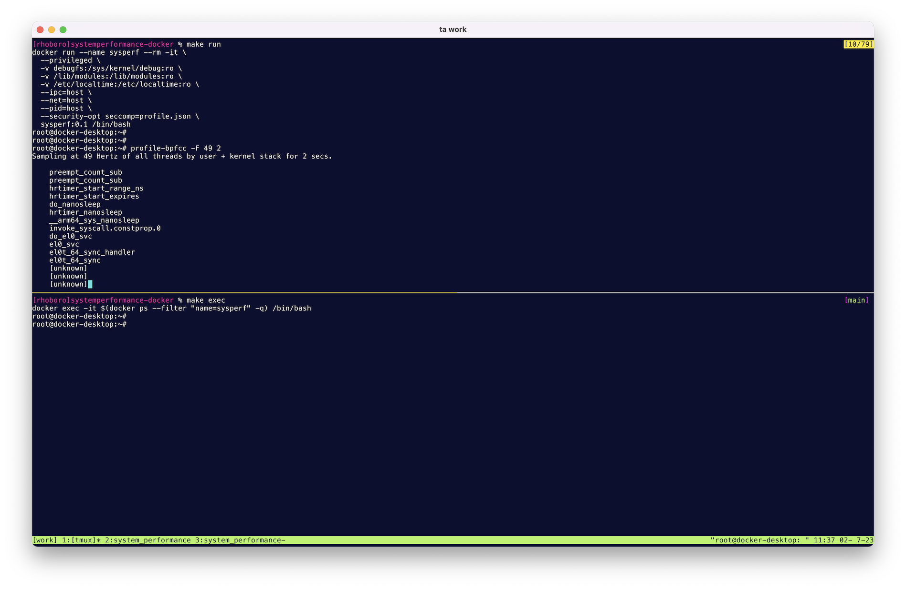

Docker image for https://www.pearson.com/en-gb/subject-catalog/p/systems-performance/P200000000297/9780136821656  ([詳解 システム・パフォーマンス 第2版](https://www.oreilly.co.jp/books/9784814400072/))

This is my personal Docker image for learning system performance skills.

Running on...

- MacBook Air(M2, 2022)
- macOS Ventura 13.4
- Docker Desktop for Mac 4.17.0(99724)
- Engine: 20.10.23
- Docker Image: ubuntu:23.04(uname -r => 5.15.49-linuxkit)
    - NOTE: Some files are copied from linuxkit/kernel:5.15.27. It is unclear how much this version mismatch affects the results.

```bash
$ make build
$ make debugfs
$ make run

# Atatch to the container
$ make exec
```


